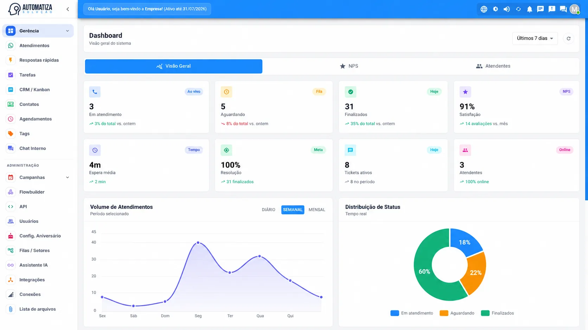
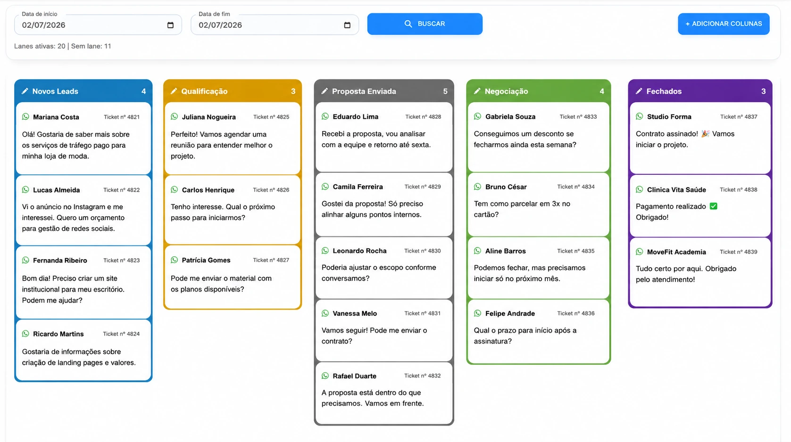
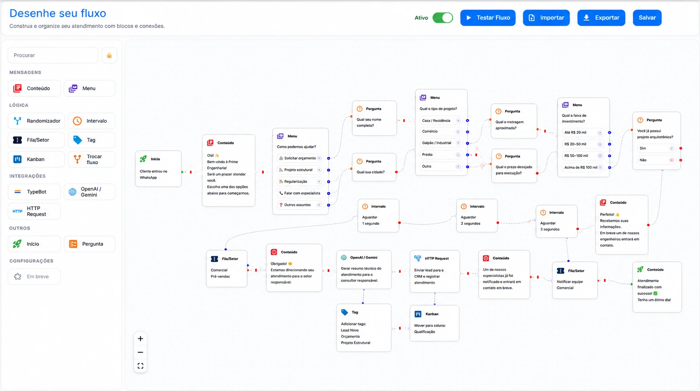
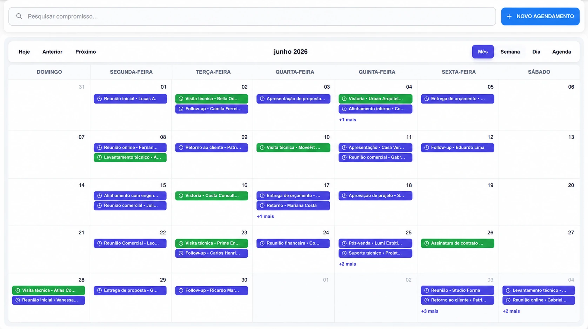
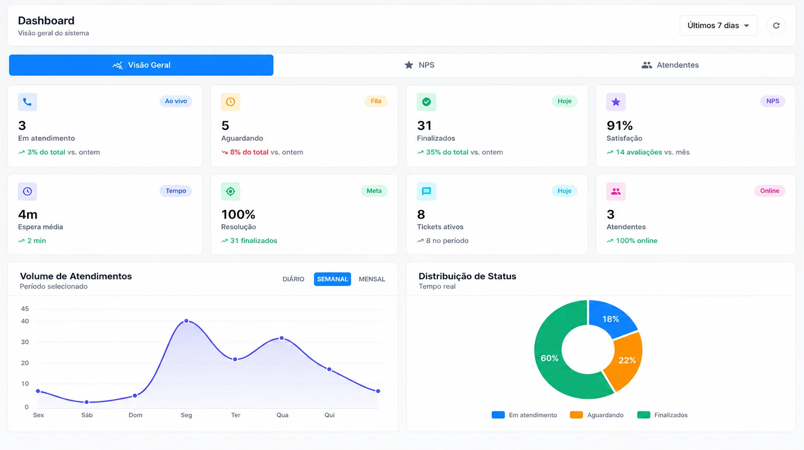

 
# 🤖 Automatiza — WhatsApp CRM

**A plataforma de atendimento ao cliente multi-tenant baseada em WhatsApp.**

Gestão de tickets em tempo real, automação no-code, assistentes de IA, campanhas e cobrança por assinatura — tudo em uma única caixa de entrada de equipe, em tempo real.

---

## 📸 Conheça o CRM Automatiza

---

## ✨ O que é o Automatiza?

O Automatiza é um **CRM SaaS baseado em WhatsApp** que transforma conversas espalhadas em uma **única caixa de entrada de atendimento em tempo real**. É uma plataforma multi-tenant: uma implantação, várias empresas, cada uma com seus planos, usuários e permissões.

- **Caixa de entrada da equipe** — cada conversa do WhatsApp roteada e com dono em tempo real
- **Automação no-code** — crie fluxos que respondem e qualificam automaticamente
- **Assistentes de IA** — chatbots (OpenAI / Gemini) e prompts personalizados
- **Modelo SaaS** — planos, faturas e provedores de pagamento integrados

---

## 💬 Atendimento e Multiatendimento

Atenda com vários agentes e filas em um só lugar, com atualização ao vivo, atribuição e histórico.

---

## 🗂️ CRM e Kanban

Organize contatos e mova tickets por um pipeline visual.

---

## 🧩 Flowbuilder + IA

Automatize conversas com um construtor de fluxos no-code e respostas com IA.

---

## 🗓️ Agendamento

Agende mensagens, envios recorrentes e automações de aniversário.

---

## 📊 Dashboard

Acompanhe as métricas e o desempenho da equipe em tempo real.

---

## 🌐 Experimente

Conheça o CRM:

- 🖥️ Site do produto: [crm.automatizasolucao.com.br](https://crm.automatizasolucao.com.br/)
- 📝 Cadastre-se para testar: [app.automatizasolucao.com.br/signup](https://app.automatizasolucao.com.br/signup)

> As capturas exibidas usam dados de demonstração, apenas para fins de apresentação.

---

[🇺🇸 English](README.md)
